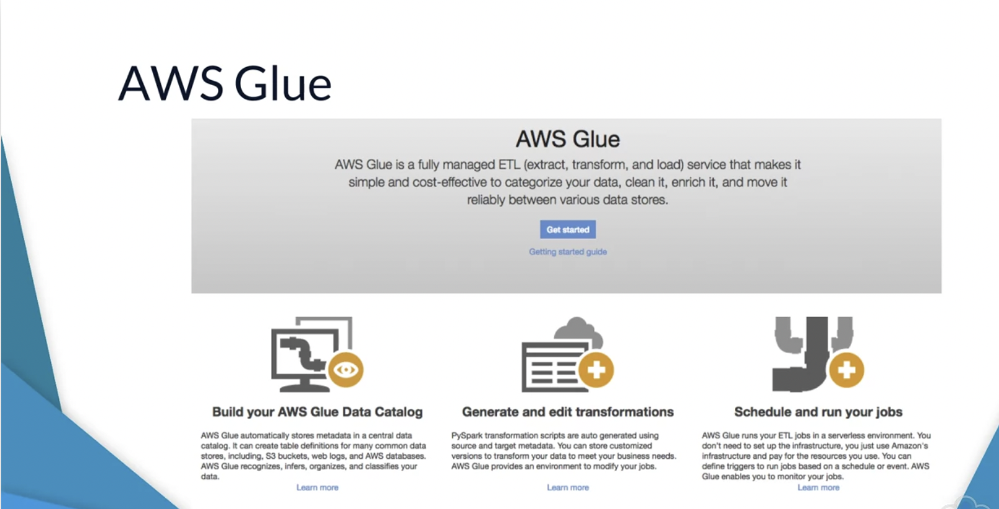
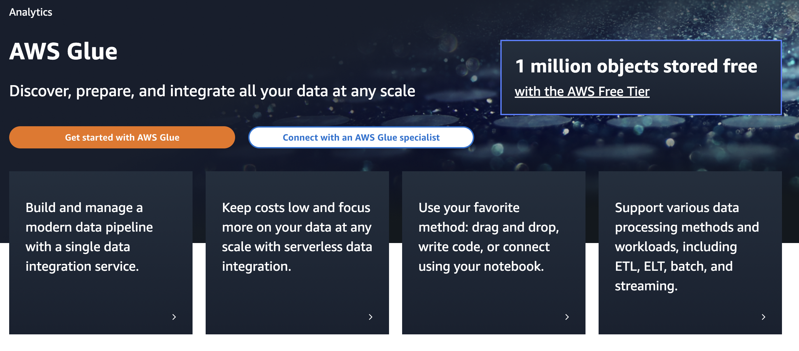
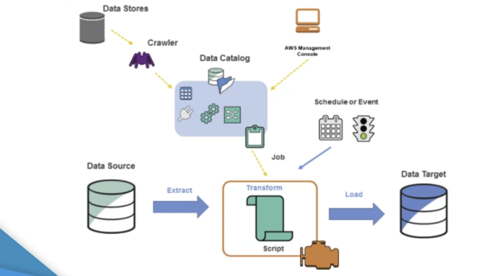
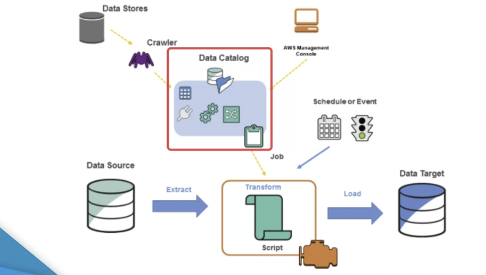
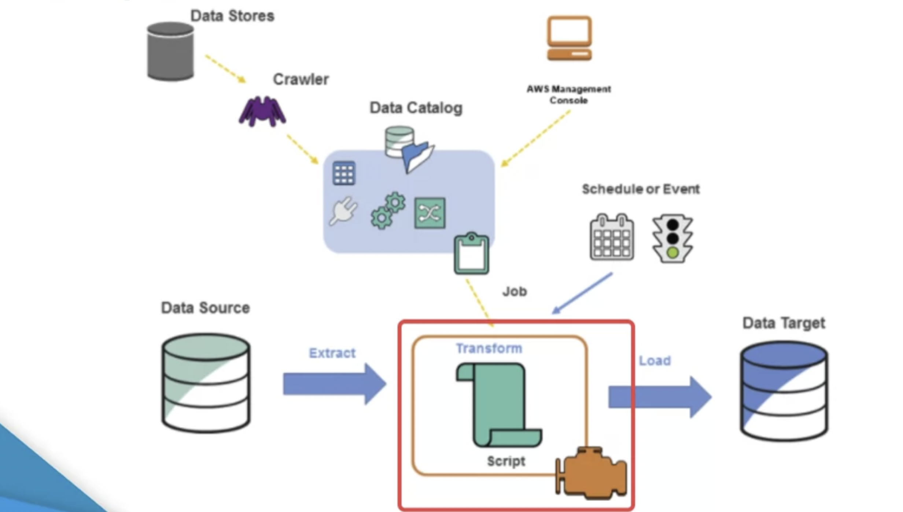
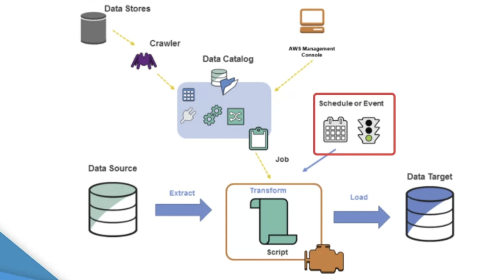
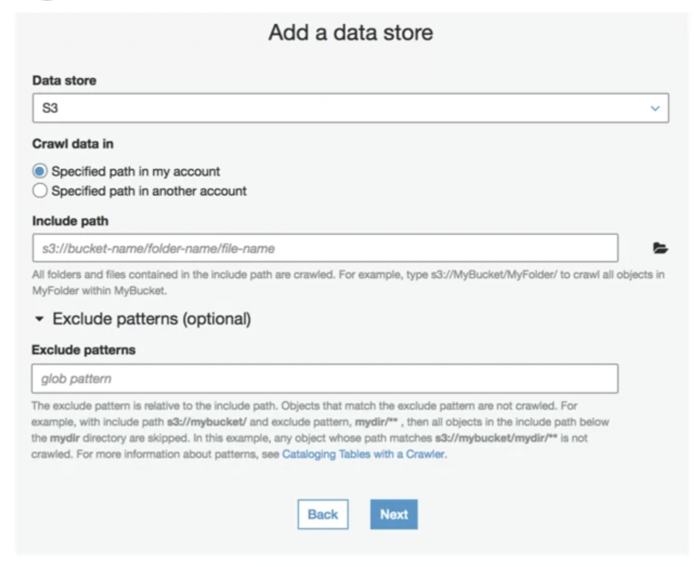
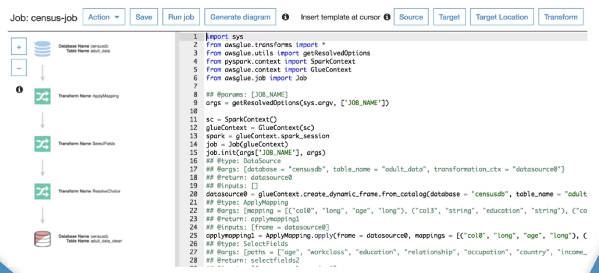
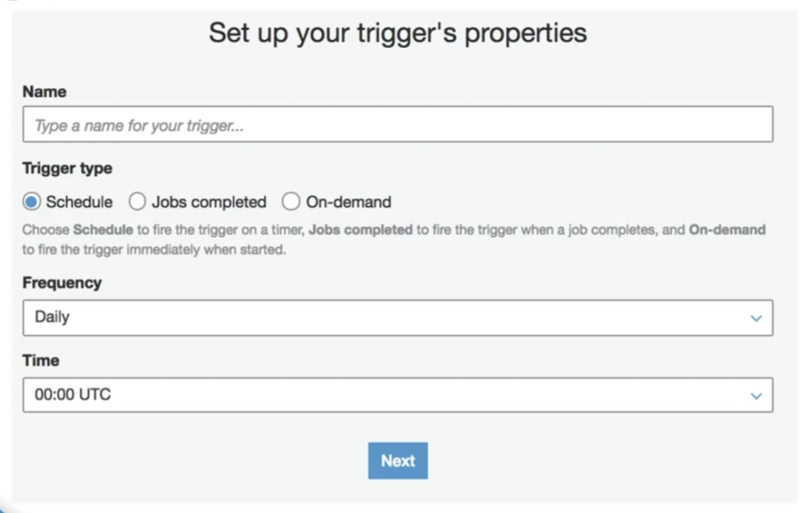

# AWS Glue

Welcome back. In this lecture we will introduce you to the AWS Glue service. AWS Glue is a fully managed, extract transforming load, ETL tool that makes it easy for you to prepare your machine learning data amongst other possibilities. Machine learning often requires you to collect and prepare data before it is used to train a machine learning model.

AWS Glue is a fully managed and serverless service. Interestingly, AWS Glue itself is built on top of a patchy spark. A patchy spark provides the underlying engine, which partitions data across multiple nodes, to achieve high throughput.

As mentioned earlier, AWS Glue is a fully managed service. The glue service is composed of three main components.

## Data Catalog

The data catalog is a central meta data repository. The meta data required, when you see the pay crawler, is centralized and persisted into the data catalog. ETL engine. The ETL engine is used to perform ETL operations on the data sets discovered and registered within the data catalog. The ETL engine will automatically generate python pies back code based on supplied configuration of source and destination data sets.

Or alternatively, you can handcraft your own ETL scripts from scratch. Job scheduler. The job scheduler is used to trigger your ETL jobs based on supplied configuration. The job scheduler performs additional tasks, such as job monitoring and retries. The first thing you would generally do with an AWS Glue is to crawl your data sources. AWS Glue can be figured to crawl data sets stored in these three or databases via JDBC connections. After the crawler is set up and activated, AWS Glue performs a crawl and derives a data schemer storing this and other associated meta data into the AWL Glue data catalog.

## ETL Jobs

AWS Glue provides an ETL tool that allows you to create and configure ETL jobs. Using the AWS Glue server's console you can simply specify input and output labels registered in the data catalog. Next, you specify the magnets between the input and output table schemers.

## Auto Generate ETL Scripts using PySpark

AWS Glue will then auto-generate an ETL script using PySpark. 

PySpark is the Spark Python API. The screen show here displays an example Glue ETL job. 

The PySpark script on the right-hand side has been auto-generated based on the initial user provided configuration. At this stage, you are free to update and refine the specifics of the script.

## End to End use case

Later on in our DMI, we'll use this to prepare our data before it is used to train our decision tree machine learning model. The last thing you tend to do within AWS Glue is to configure the scheduling of your ETL jobs.

You can use the scheduler to trigger jobs to run based on a schedule or completion of another ETL job or on the map.

## Summary

That concludes this lecture on AWS Glue. In the next lecture, we'll provide an interim demonstration of a distributed machine learning architecture that integrates all of the services we've reviewed. Go ahead and close this lecture and we'll see you shortly in the next one.
