# Demo

Welcome back. In this lecture, we begin by reviewing our demonstration of our end to end solution of our distributed machine learning environment. This demonstration is made up of four parts. Lets begin by reviewing what each part encompasses. The diagram presented here, represents the architecture that we will use for our demonstration.

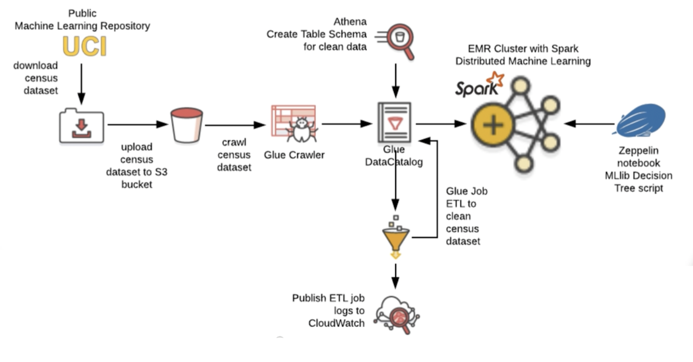

### Part One

In part one, we'll download a sample census dataset, from the UCI Public Machine Learning repository. Next, we'll create a brand new S3 bucket. Then, we'll upload the contents of the census dataset into this bucket. This will complete the first part of our demo.
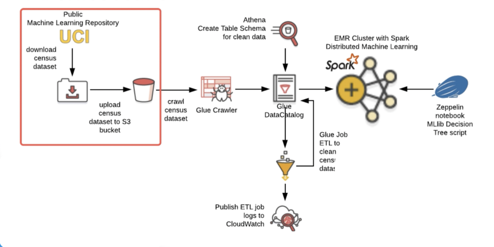

### Part Two

In part two, we'll use AWS glue to configure a new crawler, to crawl the dataset that we're hosting in our S3 bucket. Running the crawler results in a data schema being derived and stored in the data catalog. This represents the CSV file format of our census data set. Next, we'll use Amazon Athena to define a secondary table schema. We'll apply this to the glue data catalog. The reason we do this, is we want to set up an ETL job that will take our raw data, clean it, and prepare it. And then store it in this new table that we've just defined and applied through Amazon Athena.

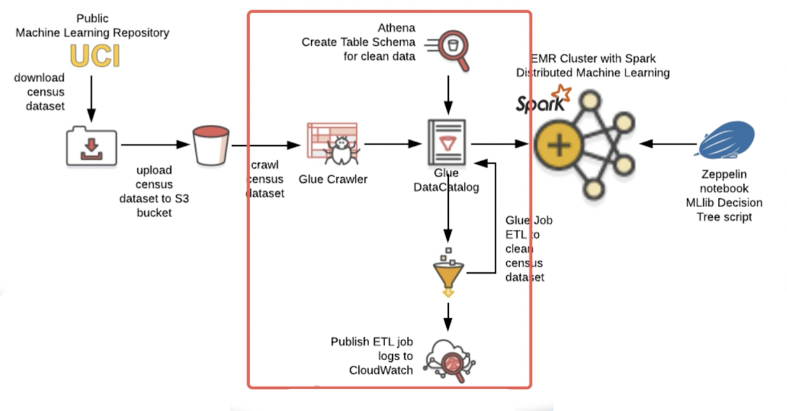

It's important to point out that the glue data catalog represents the metadata of our data sources. The raw data that we crawl, or transform through our ETL jobs, resides in an S3 bucket, or database represented by a JDBC Connection. This will become clearer as we proceed in the demonstration. The final part of part two, is to define a glue job, or an ETL process, that takes out input dataset, which is our dataset from the UCI Machine Learning Repository. And, manipulate the data so that it's prepared and ready for our machine learning process. Which runs as a job within Spark on our EMR cluster.

### Part Three

In part three, we lanch an EMR cluster. The cluster will be composed of one master node, and one core node. When we launch our EMR cluster, we'll configure it with both Apache Spark, and Apache Zeppelin.

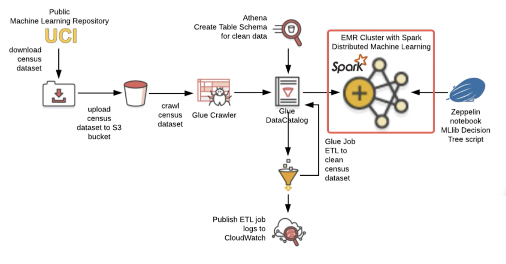

Additionally, we'll configure the EMR cluster at launch time to have access to the glue data catalog. This will give it access to the datasets that are registered within the data catalog.

### Part Four

Finally, in part four, we use a zeppelin notebook to run our MLlib decision tree script. Our decision tree script will train itself on the data stored in the data catalog. Running the zeppelin notebook provides us with an indirect position to the spark cluster.

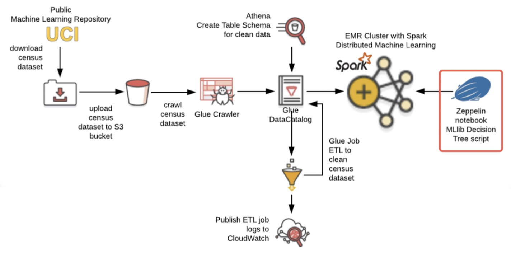

This provides a convenient way to use the MLlib module to build our decision tree script. In doing so, we can train our machine learning model, and then derive predictions from that model itself.

## Part One Demo

Okay, lets begin now with completing part one of our demonstration.
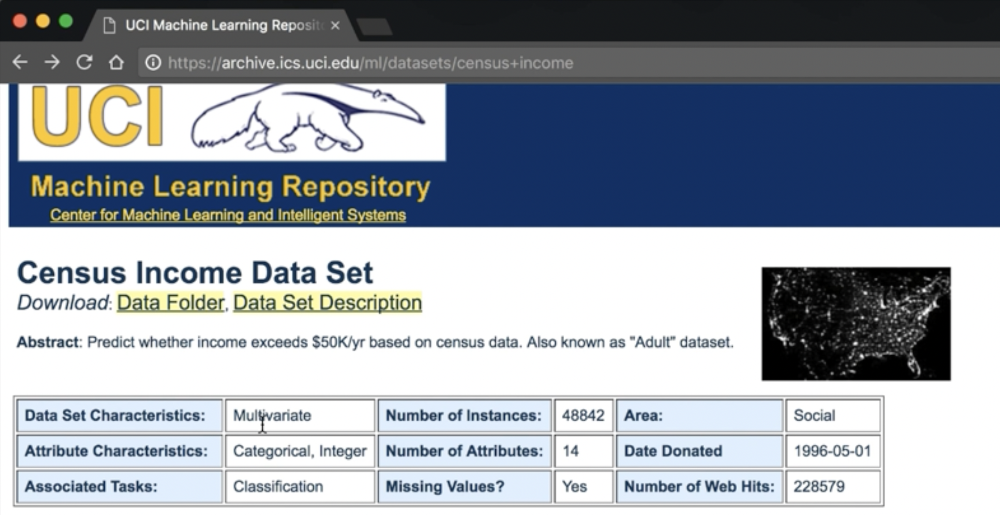

The first thing we'll do is pull up a browser and navigate to the UCI Repository. Here, we'll access the census income dataset. This dataset was collected in 1994, as part of a US census. The dataset is composed of approximately 49,000 user records.

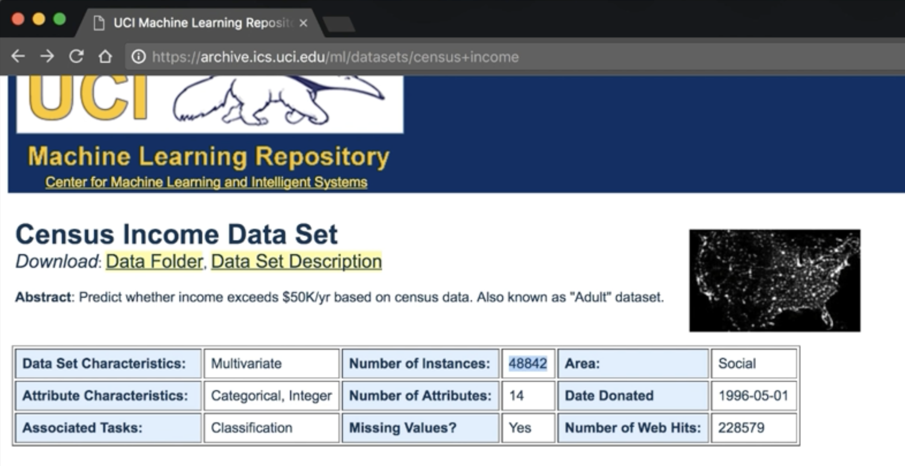

For each user collected in the census, there are 14 attributes.

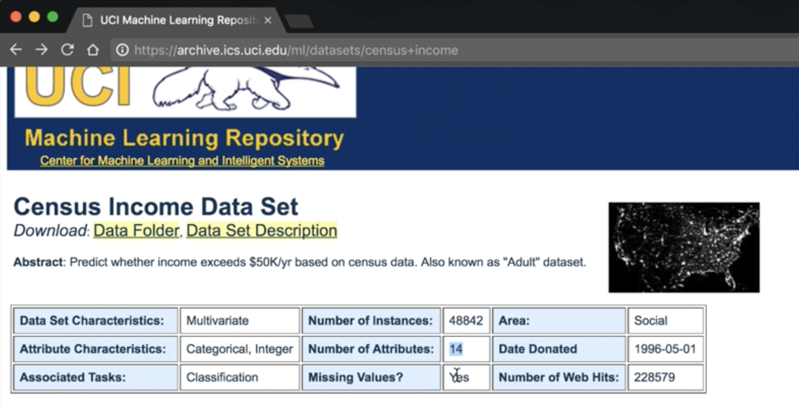

This dataset has been tagged with missing values, so we may need to consider this when we run our ATL jobs to repair this dataset before we pass it into the machine learning phase.

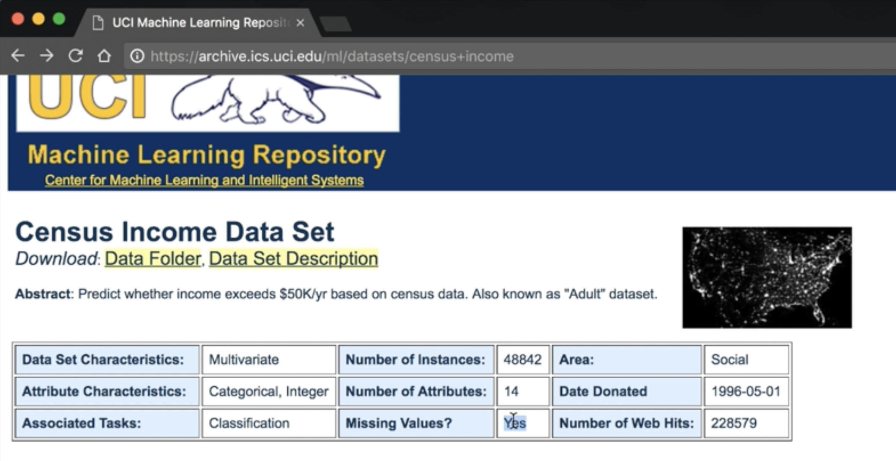

The 14 attributes that we collect per user are of types categorical and integer, and for each user record in the census, a label has been applied as to whether that user's income exceeds 50,000 per year, or not.

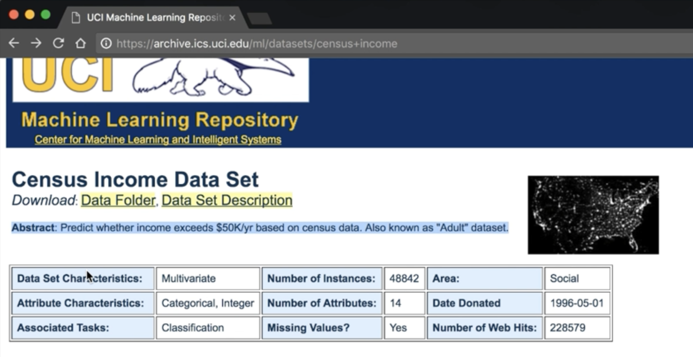

As highlighted here, this dataset is perfect for classification tasks. And it is for this reason that we'll use it when we build our decision tree machine learning model later on in the demo. Next, lets take a look at the 14 attributes, or features, collected per user in the census data. Each census record has been tagged with various attributes. 

We'll leverage some of these attributes in our machine learning model, but not all of them.

The ETL job that we set up in part two of the demo, will filter out the unused columns. Again note, that each user record in the census dataset has been labeled as to whether the user earns more than 50,000 per anum, or less than 50,000 per anum. Okay, lets move on and download this dataset. Scrolling to the top of the screen, click on the data folder link. Next, copy the adult.data link address. We'll swap over into the terminal.

Here, we'll use curl, and download it from the command line. As you can see, the download is in progress. 

```shell
curl https://archive.ics.uci.edu/ml/machine-learning-databases/adult/adult.data
```

It will take approximately five to 10 seconds to complete. Let's list the contents of the directory. Here, we should see the file that we have downloaded. We'll now print a sample of the records out to the screen, to give us an idea of both the structure and the contents. Here we can see the first 10 rows of our dataset. Notice in our sample data that there is no header row.

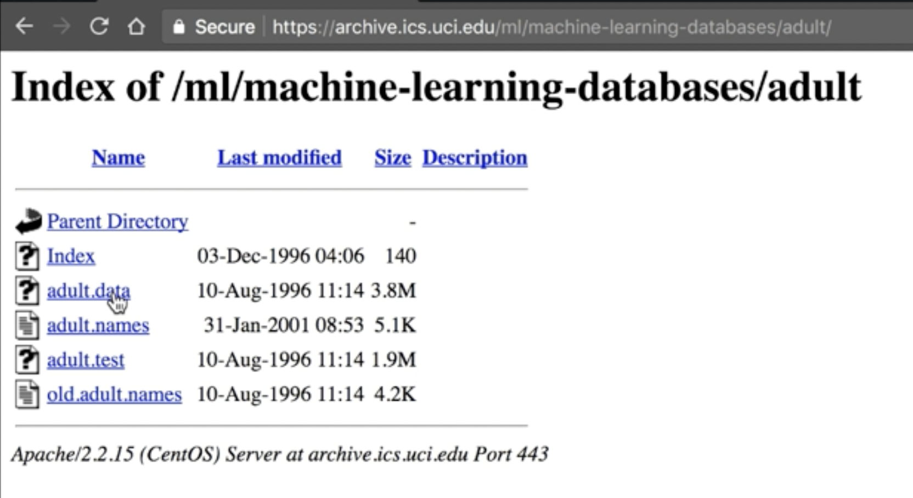

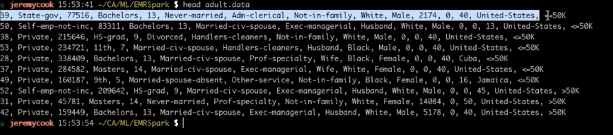

We'll deal with this in part two. The next thing to point out is that we have 14 features, or attributes per user record, and one label. The label happens to be the last column, and again tracks whether the user earns more than 50,000 per annum, or less than 50,000 per annum.

Okay, lets move on. The next thing we need to do is create a new S3 bucket to host our dataset. 


Lets use the AWS CLI to do so. Typing AWS S3, we can see that we have various options. We'll use the mb for make bucket. Lets consult the help for this. Here we can see the format required to make a new bucket on the S3 servers.

```shell
aws s3 mb help
```

Lets go back to the command line and complete this command. We'll call our new bucket, cloudacademy-emr-spark-data. 

```shell
aws s3 mb s3://cloydacademy-emr-spark-data
```

Excellent, our new bucket is being created. Lets now copy the census data file that we downloaded earlier up into our new bucket. We do so by using the aws S3 cp command. Cp for copy. We refer to our adult.data census file that we downloaded and the new bucket that we've just created on S3. 

```shell
aws s3 cp adult.data s3://cloudacademy-emr-spark-data/adult.data
```

In this case, `cloudacademy-emr-spark-data`. Pressing enter, this will begin the copy up to our new bucket. As you can see, the copy command is now in progress. This will take approximately five to 10 seconds to complete.

Okay, that is now completed. Lets now list the contents of our new bucket. We do so by typing: aws S3, ls for list, and then again the name of the new bucket. 

```shell
aws s3 ls  s3://cloudacademy-emr-spark-data
```

Here we can see the contents of our bucket, and that our file has successfully been uploaded.

Okay, that concludes part 1 of our demonstration. We'll now move on to part 2, where we'll use AWS glue to perform ETL on our dataset. Go ahead an close this lecture, and we'll see you shortly in the next one.
