# Observations on the AWS Machine Learning - Specialty Exam

## Introduction

Hello.  My name is Stephen Cole and I'm a trainer here at Cloud Academy with a lot of experience with AWS exams.

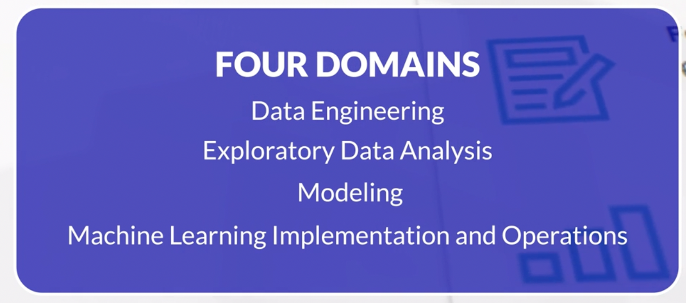

So far, I've earned nine AWS certifications over the years including the one I want to talk about today, the AWS Certified Machine Learning - Specialty exam.
Before I start, I need to be clear about something.

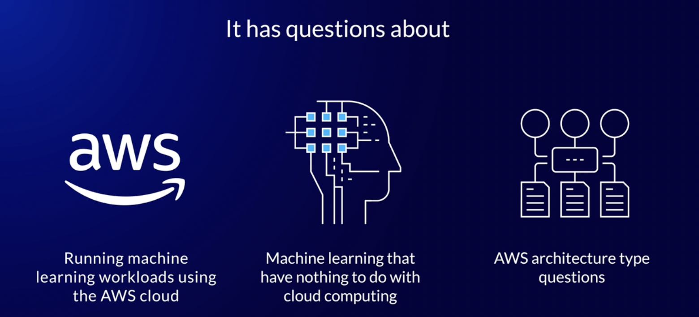

As part of the AWS testing process, everyone has to agree to a code of conduct and, as part of this agreement, we are required to keep the specifics of the exam confidential.
Violation of this agreement can result in the loss of certification and its related benefits and I am not willing to put this at risk.  

This means that I cannot share detailed information about the exam questions.  It would be cheating and, just as bad, devalue the certification.

That said, I believe that I can share my personal experience and perceptions of the exam and the content it covers without violating the confidentiality agreement.
Officially, the AWS Machine Learning - Specialty exam has four domains outlined on the exam blueprint.

## Four Domains

They are Data Engineering, Exploratory Data Analysis, Modeling, and Machine Learning Implementation and Operations.

What I found is that, when I took the exam, even though there are four domains, questions seem to fall into one of three general categories.

It has questions about running Machine Learning workloads using the AWS cloud, questions about machine learning that have nothing to do with cloud computing, and AWS architecture type questions that have what I consider to be a supporting role regarding machine learning workloads.
Let me explain what I mean.

About one-third of the exam covered Machine Learning and Deep Learning inside the AWS Cloud.  That is, these are questions about running machine learning workloads using AWS services and features.

Generally speaking, you will need to know how to use Amazon SageMaker. 

You'll need to know how to get data into the service, how to build and train machine learning models, and how to deploy them.

I feel like I should say something here about deployments.  However, I'm not sure where to start.  Then, I'm afraid I might not be able to stop once I get going.

## SageMaker

It's important to know how to manage deployments, how `SageMaker` hosted endpoints work, and how to update endpoints that are already in production.
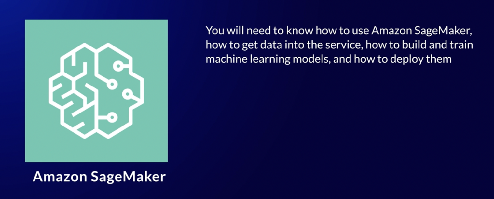

As you study the details about hosted endpoints, be sure to pay attention to Amazon Elastic Inference and when it can or can't be added to a SageMaker instance.  

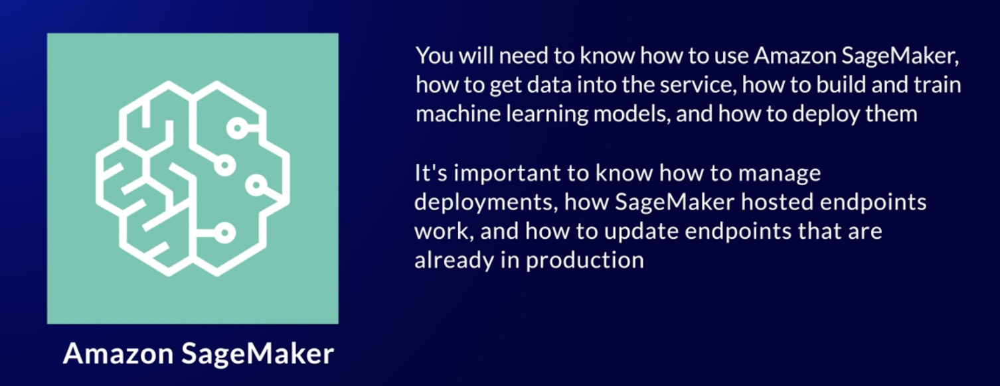

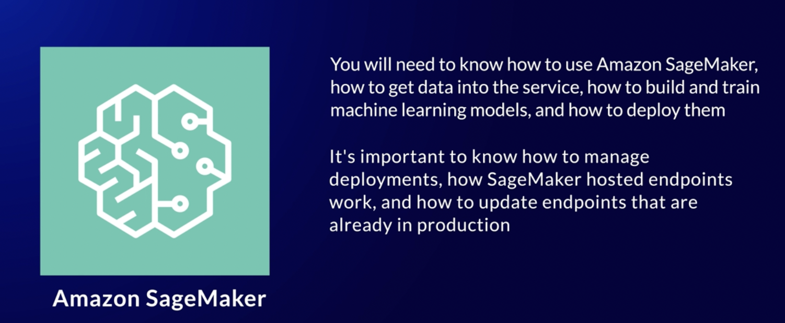

You should know--at a high level--of all the available SageMaker algorithms, what they do, and their related use cases.

## Algorithms

Algorithm selection can impact performance related to infrastructure.  What do you use, multi-core, multi-instance, or use GPU?
SageMaker can only get data from Amazon S3.  If this is news to you, you're not ready to take the exam.  Getting data into SageMaker uses one of two ways, pipe mode and file mode.  One of those ways is better to use when the data is large.
If you don't know which one, I won't spoil it for you.
Another topic that figured into the exam was hyperparameter tuning in SageMaker.  

It's important to know what options are available and to know how automatic model tuning works.

If you've not figured it out by now, knowing Amazon SageMaker is critically important to passing the exam.

## Machine Learning Only

Another third of the exam's questions were solely about Machine Learning and had nothing to do with the AWS cloud or related technologies.  

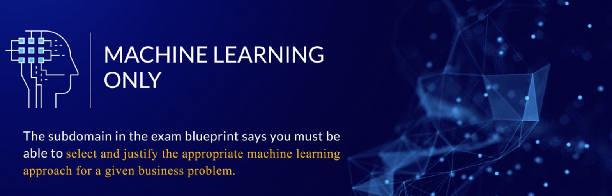

For me, these were the hardest questions because, even though I've helped people run machine learning workloads over the years, I am not a data scientist.

The subdomain in the exam blueprint says you must be able to select and justify the appropriate machine learning approach for a given business problem.
They were not kidding.

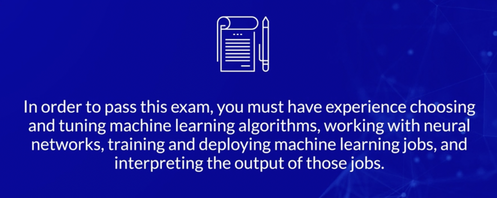

In order to pass this exam, you must have experience choosing and tuning machine learning algorithms, working with neural networks, training and deploying machine learning jobs, and interpreting the output of those jobs.

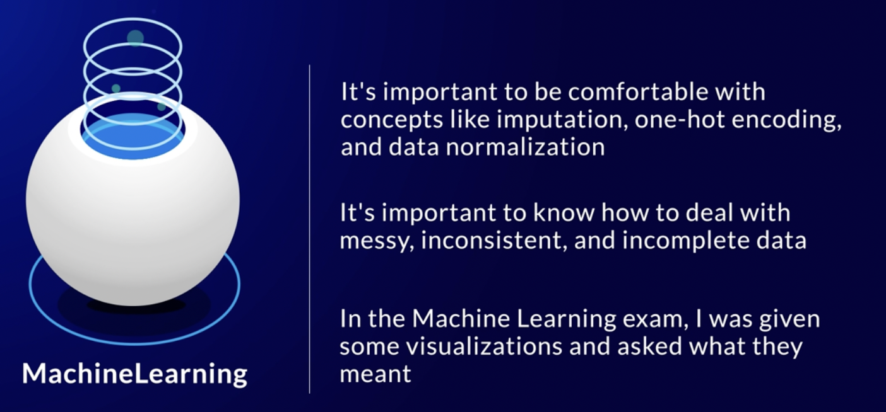

It's important to be comfortable with concepts like imputation, one-hot encoding, and data normalization.

Just like in the real world, it's important to know how to deal with messy, inconsistent, and incomplete data.  

Another observation is that, in another AWS exam, the one covering Data Analytics, I was asked what type of visualization would be best for a given problem.  

In the Machine Learning exam, I was given some visualizations and asked what they meant.  

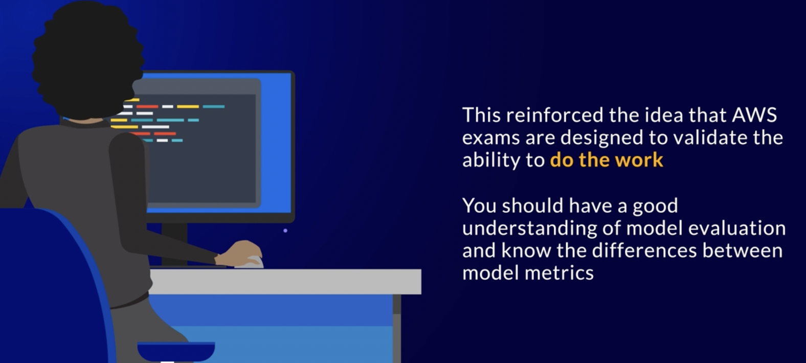

To me, this reinforced the idea that AWS exams are designed to validate the ability to do the work.

While I'm thinking about it, you should have a good understanding of model evaluation and know the differences between model metrics.  By this, I'm referring to things like accuracy, sensitivity, specificity, and F1 scoring.
Finally, while there's no math on this exam, odds are you'll be tested on basic statistical knowledge.
You'll be given a scenario and be asked which distribution would best describe it.  

## AWS Only

The third category of questions involve using the AWS cloud and have nothing to do with Machine Learning directly.

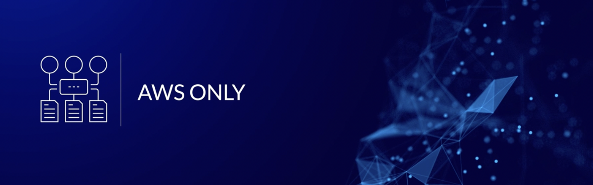

They might describe a machine learning problem but what they're asking you to do is know and understand the architecture required inside AWS to support Machine Learning workloads.
These are services such as S3, Athena, Lambda, Glue, Kinesis Data Streams, Kinesis Data Firehose, Kinesis Data Analytics, IAM, VPC endpoints, KMS, and container orchestration with ECS or EKS.

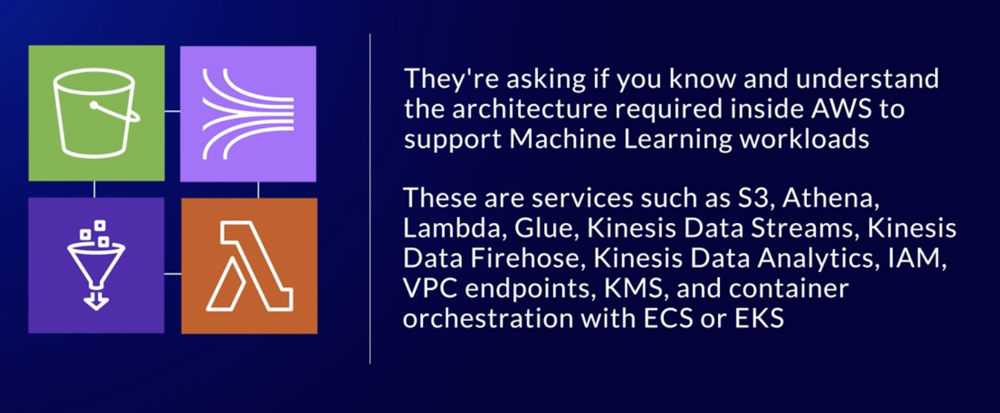

Years ago, I started my journey into the AWS cloud as a solutions architect.  So, I have had lots of experience working with and securing Amazon S3.  

The questions on this exam made me wonder if the exam creators think machine learning practitioners see data security from a single point of view, encryption.

However, when working with Machine Learning, data moves often and to many places.  This means you need to know and understand how to move data securely.  

Not just encryption but encryption in flight, working with VPC endpoints, and resource policies.

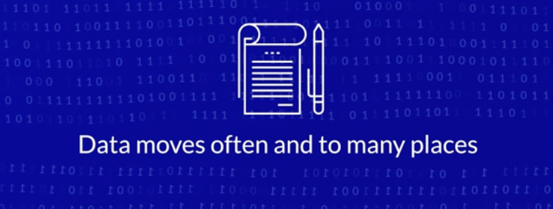

You will want a basic understanding of container orchestration with ECS or EKS.  Just like any architecture issue, there are ways to optimize containers for cost, security, and ease of use.

## AWS Lambda

In hindsight, having these types of questions made sense to me.  It's not just running the workloads, you have to get the data in the right size and shape first.
Oh, before I forget; one last thing about AWS-only questions.  
I wish I knew, exactly, how to phrase it.  AWS Lambda is important.  

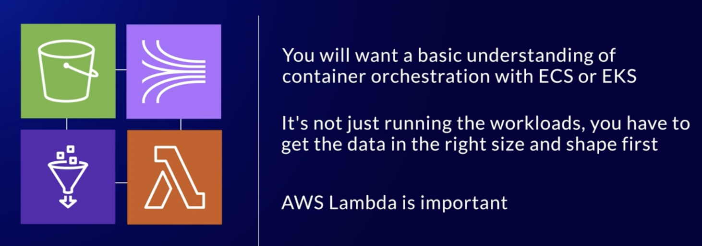

However, when it comes to Machine Learning, there's a time and place where Lambda functions are the best tool for the job.  However, sometimes, they're not appropriate at all.

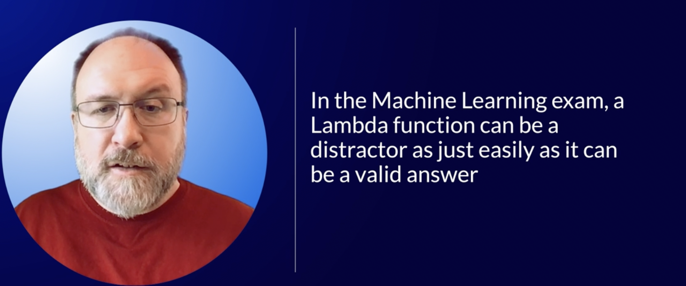

In the Machine Learning exam, a Lambda function can be a distractor as just easily as it can be a valid answer.
Just like in the associate-level exams--and, I suppose, to an extent--the professional level ones, you have to pay attention to the actual question being asked.  It probably seems silly to say this out loud.  
However, it's easy to start reading a question and make assumptions.

When reading, pay attention to that last sentence before the possible options are presented.  You might start to infer what's being asked and miss the real question.  
That is, are you being asked what approach is the simplest, takes the least amount of effort, has a high level of accuracy, or will improve performance?
I have a bit of general advice about AWS certification that I want to share.

## Another Certification before this Exam

Have another AWS certification before you take this exam.

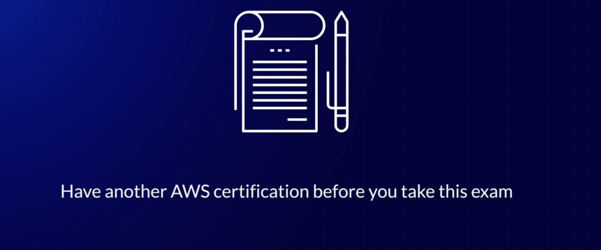

I want to say that again.  The Certified Machine Learning - Specialty exam should NOT be your first AWS exam.  
If you do not have an AWS certification already, start your journey to the Certified Machine Learning - Specialty certification by preparing for and passing the AWS Cloud Practitioner exam.

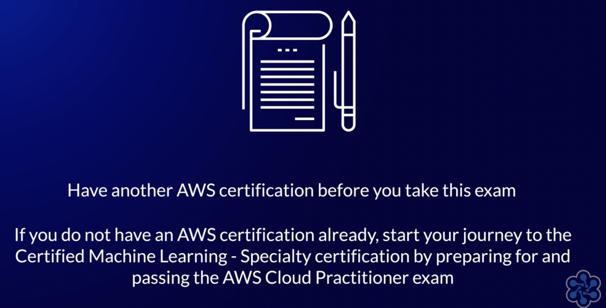

While AWS has publicly said that their exams are not designed to trick people with language, my experience makes me believe otherwise.  

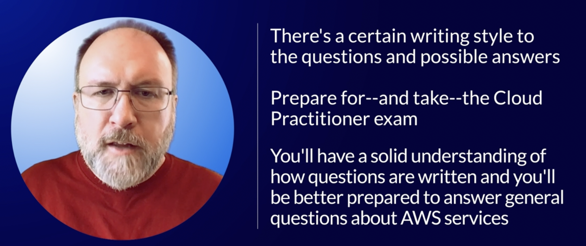

One of those things I've learned from all of the exams I've taken is that there's a certain writing style to the questions and possible answers.

Getting used to the language used in the exams can only happen by taking an exam.  So, at a minimum, prepare for--and take--the Cloud Practitioner exam.  

In doing this, you'll have a solid understanding of how questions are written and you'll be better prepared to answer general questions about AWS services.

Another reason involves money.  If you take the Cloud Practitioner exam and pass it, you'll get a discount on your next AWS exam.

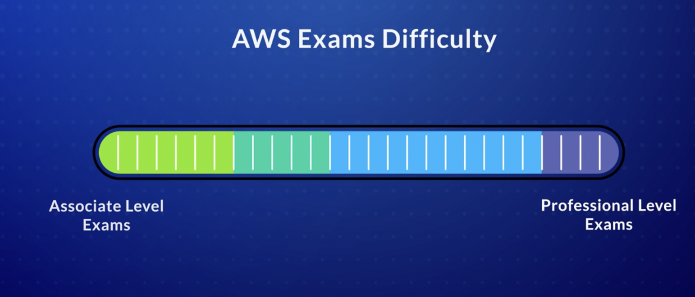

The Cloud Practitioner exam costs $100 US dollars and the Machine Learning Speciality exam costs $300.  Paying the full price, the total would be $400 USD.
However, if you pass the Cloud Practitioner--or any AWS--exam you will get a 50% discount on your next certification exam.  

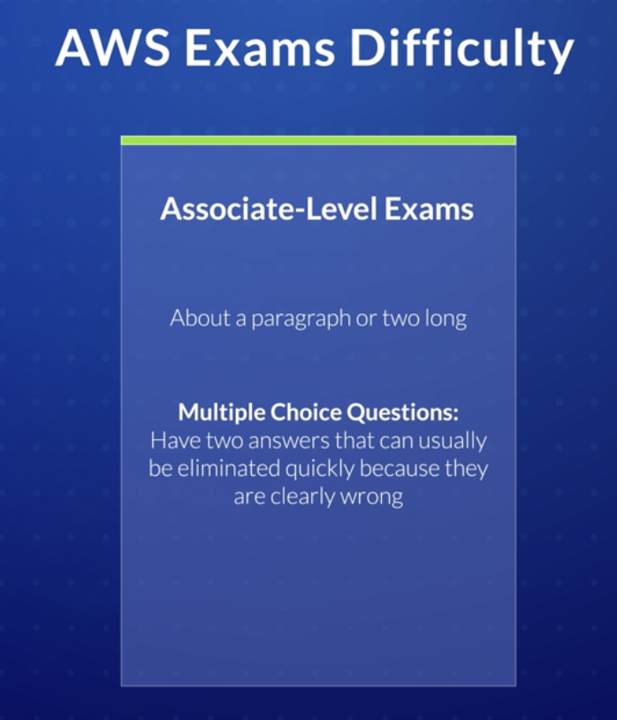

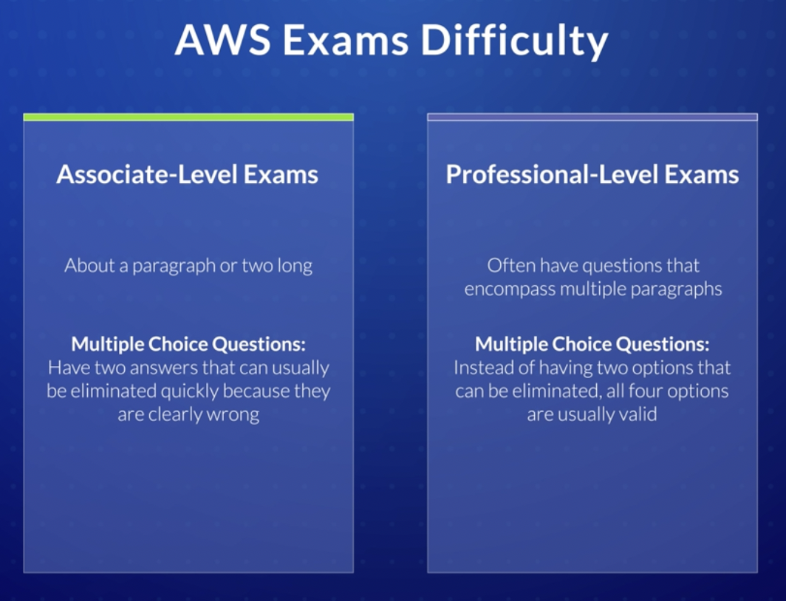

That 50% discount turns a $300 exam into $150.  Assuming you pass them, the total for both exams is $250 dollars.  A total savings of $150 USD and still $50 less than the specialty exam alone.  

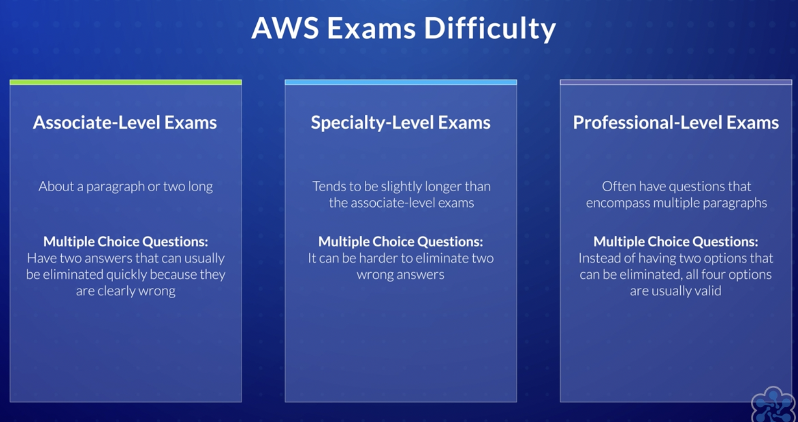

As a bonus, you'll get a free 20 question practice exam from AWS.
If you put the AWS exams on a scale that measures their difficulty level, the specialty-level exams sit about halfway between the associate level exams and the professional ones.
In general, the associate-level exams are about a paragraph or two long and--for the questions that are multiple-choice--have two answers that can usually be eliminated quickly because they are clearly wrong.

This will leave two options that are at least somewhat plausible.  Re-reading the question can help you figure out which one is the correct answer.

In contrast to this, the professional-level exams often have questions that encompass multiple paragraphs.  It's an exercise in reading comprehension.  Oof.

Then--at least for the multiple choice questions--instead of having two options that can be eliminated, all four options are usually valid.  The correct answer depends on the text of the question.

The specialty exams straddle these difficulty levels.  They tend to be slightly longer than the associate-level exams.  None of them came close to the difficulty level of the professional exams.

It's much harder, I think to eliminate two wrong answers.  More than once, however, I saw an option that was clearly nonsense.  

My sense of humor being what it is, it almost feels like comic relief at times.
There's a lot to this exam and, as I said already, it will test you on your understanding of Machine Learning.  

My past work supporting machine learning workloads was instrumental in my passing the exam and getting the certification.

I used that prior knowledge to help shape the learning path.  
If you only focus on the mechanics of machine learning, passing the test will be difficult.  
However, the learning path that we've put together will get you close and I'm excited about some of the courseware we've got in development.
Machine learning is transforming how people work and live.  

It's an amazing career path and can't wait to see what the future holds. For Cloud Academy, I'm Stephen Cole. Thank you for watching!
